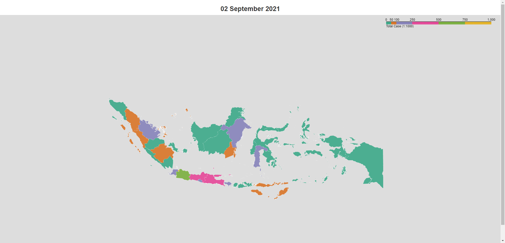

# Covid-19 Indonesia Visualization
The goal of this notebook is to visualize Covid-19 Cases in Indonesia (18 March 2020 - 2 Sept 2021)


```python
import pandas as pd
import geopandas as gpd

import folium
from datetime import datetime
from folium import Choropleth
from IPython.display import IFrame

import time
from selenium import webdriver
from selenium.webdriver.chrome.options import Options

from PIL import Image
import glob

import cv2
import os
```

__Import shape file and data file__


```python
prov = gpd.read_file('./prov.shp')
daily_covid = pd.read_excel('./covid_harian.xlsx')
prov.head()
```


<div>
<style scoped>
    .dataframe tbody tr th:only-of-type {
        vertical-align: middle;
    }

    .dataframe tbody tr th {
        vertical-align: top;
    }

    .dataframe thead th {
        text-align: right;
    }
</style>
<table border="1" class="dataframe">
  <thead>
    <tr style="text-align: right;">
      <th></th>
      <th>NAME_0</th>
      <th>NAME_1</th>
      <th>KODE</th>
      <th>geometry</th>
    </tr>
  </thead>
  <tbody>
    <tr>
      <th>0</th>
      <td>Indonesia</td>
      <td>Bangka Belitung</td>
      <td>19</td>
      <td>MULTIPOLYGON (((107.96173 -3.41100, 107.96220 ...</td>
    </tr>
    <tr>
      <th>1</th>
      <td>Indonesia</td>
      <td>Gorontalo</td>
      <td>75</td>
      <td>MULTIPOLYGON (((122.81573 0.84676, 122.81579 0...</td>
    </tr>
    <tr>
      <th>2</th>
      <td>Indonesia</td>
      <td>Riau</td>
      <td>14</td>
      <td>MULTIPOLYGON (((101.64432 -0.82552, 101.64344 ...</td>
    </tr>
    <tr>
      <th>3</th>
      <td>Indonesia</td>
      <td>Jakarta Raya</td>
      <td>31</td>
      <td>MULTIPOLYGON (((106.73563 -6.04014, 106.73548 ...</td>
    </tr>
    <tr>
      <th>4</th>
      <td>Indonesia</td>
      <td>Kepulauan Riau</td>
      <td>21</td>
      <td>MULTIPOLYGON (((105.25355 -1.29511, 105.25032 ...</td>
    </tr>
  </tbody>
</table>
</div>


```python
daily_covid.head()
```


<div>
<style scoped>
    .dataframe tbody tr th:only-of-type {
        vertical-align: middle;
    }

    .dataframe tbody tr th {
        vertical-align: top;
    }

    .dataframe thead th {
        text-align: right;
    }
</style>
<table border="1" class="dataframe">
  <thead>
    <tr style="text-align: right;">
      <th></th>
      <th>Unnamed: 0</th>
      <th>Aceh</th>
      <th>Bali</th>
      <th>Banten</th>
      <th>Babel</th>
      <th>Bengkulu</th>
      <th>DIY</th>
      <th>Jakarta</th>
      <th>Jambi</th>
      <th>Jabar</th>
      <th>...</th>
      <th>Sulteng</th>
      <th>Lampung</th>
      <th>Riau</th>
      <th>Malut</th>
      <th>Maluku</th>
      <th>Papbar</th>
      <th>Papua</th>
      <th>Sulbar</th>
      <th>NTT</th>
      <th>Gorontalo</th>
    </tr>
  </thead>
  <tbody>
    <tr>
      <th>0</th>
      <td>2020-03-18</td>
      <td>0</td>
      <td>1</td>
      <td>17</td>
      <td>0</td>
      <td>0</td>
      <td>3</td>
      <td>158</td>
      <td>0</td>
      <td>24</td>
      <td>...</td>
      <td>0</td>
      <td>1</td>
      <td>1</td>
      <td>0</td>
      <td>0</td>
      <td>0</td>
      <td>0</td>
      <td>0</td>
      <td>0</td>
      <td>0</td>
    </tr>
    <tr>
      <th>1</th>
      <td>2020-03-19</td>
      <td>0</td>
      <td>1</td>
      <td>27</td>
      <td>0</td>
      <td>0</td>
      <td>5</td>
      <td>210</td>
      <td>0</td>
      <td>26</td>
      <td>...</td>
      <td>0</td>
      <td>1</td>
      <td>2</td>
      <td>0</td>
      <td>0</td>
      <td>0</td>
      <td>0</td>
      <td>0</td>
      <td>0</td>
      <td>0</td>
    </tr>
    <tr>
      <th>2</th>
      <td>2020-03-20</td>
      <td>0</td>
      <td>4</td>
      <td>37</td>
      <td>0</td>
      <td>0</td>
      <td>4</td>
      <td>215</td>
      <td>0</td>
      <td>41</td>
      <td>...</td>
      <td>0</td>
      <td>1</td>
      <td>1</td>
      <td>0</td>
      <td>0</td>
      <td>0</td>
      <td>0</td>
      <td>0</td>
      <td>0</td>
      <td>0</td>
    </tr>
    <tr>
      <th>3</th>
      <td>2020-03-21</td>
      <td>0</td>
      <td>3</td>
      <td>43</td>
      <td>0</td>
      <td>0</td>
      <td>5</td>
      <td>267</td>
      <td>0</td>
      <td>55</td>
      <td>...</td>
      <td>0</td>
      <td>1</td>
      <td>1</td>
      <td>0</td>
      <td>0</td>
      <td>0</td>
      <td>0</td>
      <td>0</td>
      <td>0</td>
      <td>0</td>
    </tr>
    <tr>
      <th>4</th>
      <td>2020-03-22</td>
      <td>0</td>
      <td>3</td>
      <td>47</td>
      <td>0</td>
      <td>0</td>
      <td>5</td>
      <td>307</td>
      <td>0</td>
      <td>59</td>
      <td>...</td>
      <td>0</td>
      <td>1</td>
      <td>1</td>
      <td>0</td>
      <td>1</td>
      <td>0</td>
      <td>2</td>
      <td>0</td>
      <td>0</td>
      <td>0</td>
    </tr>
  </tbody>
</table>
<p>5 rows × 35 columns</p>
</div>


__Cleaning and shaping the data so it can be merged__


```python
prov = prov.drop(['NAME_0', 'KODE'], axis=1)
prov = prov.set_index('NAME_1')
prov = prov.sort_index(ascending=True)

daily_covid = pd.DataFrame(daily_covid)
daily_covid = daily_covid.rename(columns={'Unnamed: 0': 'Tanggal', 'Aceh': 'Aceh', 'Bali': 'Bali',
                                          'Babel': 'Bangka Belitung', 'Banten': 'Banten', 'Bengkulu': 'Bengkulu',
                                          'Gorontalo': 'Gorontalo', 'Jabar': 'Jawa Barat', 'Jakarta': 'Jakarta Raya',
                                          'Jambi': 'Jambi', 'Jateng': 'Jawa Tengah', 'Jatim': 'Jawa Timur',
                                          'Kalbar': 'Kalimantan Barat', 'Kalsel': 'Kalimantan Selatan',
                                          'Kaltara': 'Kalimantan Utara', 'Kalteng': 'Kalimantan Tengah',
                                          'Kaltim': 'Kalimantan Timur', 'Kep Riau': 'Kepulauan Riau',
                                          'Lampung': 'Lampung', 'Maluku': 'Maluku', 'Malut': 'Maluku Utara',
                                          'NTB': 'Nusa Tenggara Barat', 'NTT': 'Nusa Tenggara Timur',
                                          'Papbar': 'Papua Barat', 'Papua': 'Papua', 'Riau': 'Riau',
                                          'Sulbar': 'Sulawesi Barat', 'Sulsel': 'Sulawesi Selatan',
                                          'Sulteng': 'Sulawesi Tengah', 'Sultra': 'Sulawesi Tenggara',
                                          'Sulut': 'Sulawesi Utara', 'Sumbar': 'Sumatera Barat',
                                          'Sumsel': 'Sumatera Selatan', 'Sumut': 'Sumatera Utara', 'DIY': 'Yogyakarta'})
daily_covid.to_csv('daily_covid_t')
daily_covid['Tanggal'] = daily_covid['Tanggal'].astype(str)
daily_covid_fix = daily_covid.set_index(daily_covid['Tanggal'])
daily_covid_fix = daily_covid_fix.drop(['Tanggal'], axis=1)
daily_covid_fix = daily_covid_fix.T
daily_covid_fix = daily_covid_fix.sort_index(ascending=True)


```


<div>
<style scoped>
    .dataframe tbody tr th:only-of-type {
        vertical-align: middle;
    }

    .dataframe tbody tr th {
        vertical-align: top;
    }

    .dataframe thead th {
        text-align: right;
    }
</style>
<table border="1" class="dataframe">
  <thead>
    <tr style="text-align: right;">
      <th>Tanggal</th>
      <th>2020-03-18</th>
      <th>2020-03-19</th>
      <th>2020-03-20</th>
      <th>2020-03-21</th>
      <th>2020-03-22</th>
      <th>2020-03-23</th>
      <th>2020-03-24</th>
      <th>2020-03-25</th>
      <th>2020-03-26</th>
      <th>2020-03-27</th>
      <th>...</th>
      <th>2021-08-24</th>
      <th>2021-08-25</th>
      <th>2021-08-26</th>
      <th>2021-08-27</th>
      <th>2021-08-28</th>
      <th>2021-08-29</th>
      <th>2021-08-30</th>
      <th>2021-08-31</th>
      <th>2021-09-01</th>
      <th>2021-09-02</th>
    </tr>
  </thead>
  <tbody>
    <tr>
      <th>Aceh</th>
      <td>0</td>
      <td>0</td>
      <td>0</td>
      <td>0</td>
      <td>0</td>
      <td>0</td>
      <td>0</td>
      <td>0</td>
      <td>1</td>
      <td>4</td>
      <td>...</td>
      <td>30659</td>
      <td>31027</td>
      <td>31388</td>
      <td>31776</td>
      <td>32083</td>
      <td>32418</td>
      <td>32608</td>
      <td>32935</td>
      <td>33245</td>
      <td>33568</td>
    </tr>
    <tr>
      <th>Bali</th>
      <td>1</td>
      <td>1</td>
      <td>4</td>
      <td>3</td>
      <td>3</td>
      <td>6</td>
      <td>6</td>
      <td>9</td>
      <td>9</td>
      <td>9</td>
      <td>...</td>
      <td>103508</td>
      <td>104254</td>
      <td>104819</td>
      <td>105377</td>
      <td>105851</td>
      <td>106153</td>
      <td>106458</td>
      <td>106834</td>
      <td>107233</td>
      <td>107562</td>
    </tr>
    <tr>
      <th>Bangka Belitung</th>
      <td>0</td>
      <td>0</td>
      <td>0</td>
      <td>0</td>
      <td>0</td>
      <td>0</td>
      <td>0</td>
      <td>0</td>
      <td>0</td>
      <td>0</td>
      <td>...</td>
      <td>45040</td>
      <td>45428</td>
      <td>45773</td>
      <td>46085</td>
      <td>46370</td>
      <td>46600</td>
      <td>46753</td>
      <td>47101</td>
      <td>47399</td>
      <td>47677</td>
    </tr>
    <tr>
      <th>Banten</th>
      <td>17</td>
      <td>27</td>
      <td>37</td>
      <td>43</td>
      <td>47</td>
      <td>56</td>
      <td>65</td>
      <td>67</td>
      <td>67</td>
      <td>84</td>
      <td>...</td>
      <td>127397</td>
      <td>127752</td>
      <td>127991</td>
      <td>128257</td>
      <td>128473</td>
      <td>128650</td>
      <td>128751</td>
      <td>129016</td>
      <td>129194</td>
      <td>129366</td>
    </tr>
    <tr>
      <th>Bengkulu</th>
      <td>0</td>
      <td>0</td>
      <td>0</td>
      <td>0</td>
      <td>0</td>
      <td>0</td>
      <td>0</td>
      <td>0</td>
      <td>0</td>
      <td>0</td>
      <td>...</td>
      <td>22078</td>
      <td>22153</td>
      <td>22244</td>
      <td>22318</td>
      <td>22369</td>
      <td>22409</td>
      <td>22421</td>
      <td>22470</td>
      <td>22497</td>
      <td>22522</td>
    </tr>
  </tbody>
</table>
<p>5 rows × 534 columns</p>
</div>


```python
prov.head()
```


<div>
<style scoped>
    .dataframe tbody tr th:only-of-type {
        vertical-align: middle;
    }

    .dataframe tbody tr th {
        vertical-align: top;
    }

    .dataframe thead th {
        text-align: right;
    }
</style>
<table border="1" class="dataframe">
  <thead>
    <tr style="text-align: right;">
      <th></th>
      <th>geometry</th>
    </tr>
    <tr>
      <th>NAME_1</th>
      <th></th>
    </tr>
  </thead>
  <tbody>
    <tr>
      <th>Aceh</th>
      <td>MULTIPOLYGON (((96.66509 2.12018, 96.66765 2.1...</td>
    </tr>
    <tr>
      <th>Bali</th>
      <td>MULTIPOLYGON (((114.61025 -8.12284, 114.61015 ...</td>
    </tr>
    <tr>
      <th>Bangka Belitung</th>
      <td>MULTIPOLYGON (((107.96173 -3.41100, 107.96220 ...</td>
    </tr>
    <tr>
      <th>Banten</th>
      <td>MULTIPOLYGON (((105.54977 -6.99566, 105.55035 ...</td>
    </tr>
    <tr>
      <th>Bengkulu</th>
      <td>MULTIPOLYGON (((102.37586 -5.36968, 102.38067 ...</td>
    </tr>
  </tbody>
</table>
</div>


```python
daily_covid_fix.head()
```


<div>
<style scoped>
    .dataframe tbody tr th:only-of-type {
        vertical-align: middle;
    }

    .dataframe tbody tr th {
        vertical-align: top;
    }

    .dataframe thead th {
        text-align: right;
    }
</style>
<table border="1" class="dataframe">
  <thead>
    <tr style="text-align: right;">
      <th>Tanggal</th>
      <th>2020-03-18</th>
      <th>2020-03-19</th>
      <th>2020-03-20</th>
      <th>2020-03-21</th>
      <th>2020-03-22</th>
      <th>2020-03-23</th>
      <th>2020-03-24</th>
      <th>2020-03-25</th>
      <th>2020-03-26</th>
      <th>2020-03-27</th>
      <th>...</th>
      <th>2021-08-24</th>
      <th>2021-08-25</th>
      <th>2021-08-26</th>
      <th>2021-08-27</th>
      <th>2021-08-28</th>
      <th>2021-08-29</th>
      <th>2021-08-30</th>
      <th>2021-08-31</th>
      <th>2021-09-01</th>
      <th>2021-09-02</th>
    </tr>
  </thead>
  <tbody>
    <tr>
      <th>Aceh</th>
      <td>0</td>
      <td>0</td>
      <td>0</td>
      <td>0</td>
      <td>0</td>
      <td>0</td>
      <td>0</td>
      <td>0</td>
      <td>1</td>
      <td>4</td>
      <td>...</td>
      <td>30659</td>
      <td>31027</td>
      <td>31388</td>
      <td>31776</td>
      <td>32083</td>
      <td>32418</td>
      <td>32608</td>
      <td>32935</td>
      <td>33245</td>
      <td>33568</td>
    </tr>
    <tr>
      <th>Bali</th>
      <td>1</td>
      <td>1</td>
      <td>4</td>
      <td>3</td>
      <td>3</td>
      <td>6</td>
      <td>6</td>
      <td>9</td>
      <td>9</td>
      <td>9</td>
      <td>...</td>
      <td>103508</td>
      <td>104254</td>
      <td>104819</td>
      <td>105377</td>
      <td>105851</td>
      <td>106153</td>
      <td>106458</td>
      <td>106834</td>
      <td>107233</td>
      <td>107562</td>
    </tr>
    <tr>
      <th>Bangka Belitung</th>
      <td>0</td>
      <td>0</td>
      <td>0</td>
      <td>0</td>
      <td>0</td>
      <td>0</td>
      <td>0</td>
      <td>0</td>
      <td>0</td>
      <td>0</td>
      <td>...</td>
      <td>45040</td>
      <td>45428</td>
      <td>45773</td>
      <td>46085</td>
      <td>46370</td>
      <td>46600</td>
      <td>46753</td>
      <td>47101</td>
      <td>47399</td>
      <td>47677</td>
    </tr>
    <tr>
      <th>Banten</th>
      <td>17</td>
      <td>27</td>
      <td>37</td>
      <td>43</td>
      <td>47</td>
      <td>56</td>
      <td>65</td>
      <td>67</td>
      <td>67</td>
      <td>84</td>
      <td>...</td>
      <td>127397</td>
      <td>127752</td>
      <td>127991</td>
      <td>128257</td>
      <td>128473</td>
      <td>128650</td>
      <td>128751</td>
      <td>129016</td>
      <td>129194</td>
      <td>129366</td>
    </tr>
    <tr>
      <th>Bengkulu</th>
      <td>0</td>
      <td>0</td>
      <td>0</td>
      <td>0</td>
      <td>0</td>
      <td>0</td>
      <td>0</td>
      <td>0</td>
      <td>0</td>
      <td>0</td>
      <td>...</td>
      <td>22078</td>
      <td>22153</td>
      <td>22244</td>
      <td>22318</td>
      <td>22369</td>
      <td>22409</td>
      <td>22421</td>
      <td>22470</td>
      <td>22497</td>
      <td>22522</td>
    </tr>
  </tbody>
</table>
<p>5 rows × 534 columns</p>
</div>


__Merging and saving data to csv__


```python
df = prov.merge(daily_covid_fix, left_index=True, right_index=True, how='inner')
df.head()
```


<div>
<style scoped>
    .dataframe tbody tr th:only-of-type {
        vertical-align: middle;
    }

    .dataframe tbody tr th {
        vertical-align: top;
    }

    .dataframe thead th {
        text-align: right;
    }
</style>
<table border="1" class="dataframe">
  <thead>
    <tr style="text-align: right;">
      <th></th>
      <th>geometry</th>
      <th>2020-03-18</th>
      <th>2020-03-19</th>
      <th>2020-03-20</th>
      <th>2020-03-21</th>
      <th>2020-03-22</th>
      <th>2020-03-23</th>
      <th>2020-03-24</th>
      <th>2020-03-25</th>
      <th>2020-03-26</th>
      <th>...</th>
      <th>2021-08-24</th>
      <th>2021-08-25</th>
      <th>2021-08-26</th>
      <th>2021-08-27</th>
      <th>2021-08-28</th>
      <th>2021-08-29</th>
      <th>2021-08-30</th>
      <th>2021-08-31</th>
      <th>2021-09-01</th>
      <th>2021-09-02</th>
    </tr>
    <tr>
      <th>NAME_1</th>
      <th></th>
      <th></th>
      <th></th>
      <th></th>
      <th></th>
      <th></th>
      <th></th>
      <th></th>
      <th></th>
      <th></th>
      <th></th>
      <th></th>
      <th></th>
      <th></th>
      <th></th>
      <th></th>
      <th></th>
      <th></th>
      <th></th>
      <th></th>
      <th></th>
    </tr>
  </thead>
  <tbody>
    <tr>
      <th>Aceh</th>
      <td>MULTIPOLYGON (((96.66509 2.12018, 96.66765 2.1...</td>
      <td>0</td>
      <td>0</td>
      <td>0</td>
      <td>0</td>
      <td>0</td>
      <td>0</td>
      <td>0</td>
      <td>0</td>
      <td>1</td>
      <td>...</td>
      <td>30659</td>
      <td>31027</td>
      <td>31388</td>
      <td>31776</td>
      <td>32083</td>
      <td>32418</td>
      <td>32608</td>
      <td>32935</td>
      <td>33245</td>
      <td>33568</td>
    </tr>
    <tr>
      <th>Bali</th>
      <td>MULTIPOLYGON (((114.61025 -8.12284, 114.61015 ...</td>
      <td>1</td>
      <td>1</td>
      <td>4</td>
      <td>3</td>
      <td>3</td>
      <td>6</td>
      <td>6</td>
      <td>9</td>
      <td>9</td>
      <td>...</td>
      <td>103508</td>
      <td>104254</td>
      <td>104819</td>
      <td>105377</td>
      <td>105851</td>
      <td>106153</td>
      <td>106458</td>
      <td>106834</td>
      <td>107233</td>
      <td>107562</td>
    </tr>
    <tr>
      <th>Bangka Belitung</th>
      <td>MULTIPOLYGON (((107.96173 -3.41100, 107.96220 ...</td>
      <td>0</td>
      <td>0</td>
      <td>0</td>
      <td>0</td>
      <td>0</td>
      <td>0</td>
      <td>0</td>
      <td>0</td>
      <td>0</td>
      <td>...</td>
      <td>45040</td>
      <td>45428</td>
      <td>45773</td>
      <td>46085</td>
      <td>46370</td>
      <td>46600</td>
      <td>46753</td>
      <td>47101</td>
      <td>47399</td>
      <td>47677</td>
    </tr>
    <tr>
      <th>Banten</th>
      <td>MULTIPOLYGON (((105.54977 -6.99566, 105.55035 ...</td>
      <td>17</td>
      <td>27</td>
      <td>37</td>
      <td>43</td>
      <td>47</td>
      <td>56</td>
      <td>65</td>
      <td>67</td>
      <td>67</td>
      <td>...</td>
      <td>127397</td>
      <td>127752</td>
      <td>127991</td>
      <td>128257</td>
      <td>128473</td>
      <td>128650</td>
      <td>128751</td>
      <td>129016</td>
      <td>129194</td>
      <td>129366</td>
    </tr>
    <tr>
      <th>Bengkulu</th>
      <td>MULTIPOLYGON (((102.37586 -5.36968, 102.38067 ...</td>
      <td>0</td>
      <td>0</td>
      <td>0</td>
      <td>0</td>
      <td>0</td>
      <td>0</td>
      <td>0</td>
      <td>0</td>
      <td>0</td>
      <td>...</td>
      <td>22078</td>
      <td>22153</td>
      <td>22244</td>
      <td>22318</td>
      <td>22369</td>
      <td>22409</td>
      <td>22421</td>
      <td>22470</td>
      <td>22497</td>
      <td>22522</td>
    </tr>
  </tbody>
</table>
<p>5 rows × 535 columns</p>
</div>


__Create function to save map__


```python
def embed_map(the_map, filename):
    the_map.save(filename)
    return IFrame(filename, width='100%', height='500px')
```

__Create list for iteration (date)__


```python
list_of_days = daily_covid['Tanggal']
```

__Plotting map using iteration that we made__


```python
for day in list_of_days:
    df_geo = df.copy()

    map1 = folium.Map(tiles=None, zoom_control=False)

    choropleth = Choropleth(geo_data=df_geo.__geo_interface__,
                            data=df_geo[day]/1000,
                            key_on='feature.id',
                            bins=[0, 50, 100, 250, 500, 750, 1000],
                            threshold_scale=[0, 50, 100, 250, 500, 750, 1000],
                            fill_color='Dark2',
                            fill_opacity=0.75,
                            line_color='white',
                            line_weight=0.25,
                            line_opacity=0.75,
                            legend_name='Total Case (1:1000)').add_to(map1)

    map1.fit_bounds([[12.728487, 101.419820], [-13.729686, 136.219106]])

    date = pd.to_datetime(day)
    date = datetime.strftime(date, '%d %B %Y')

    title_html = f'''<h3 align="center" style="font-size:25px">
                        <b>{date}</b></h3>
                     '''
    map1.get_root().html.add_child(folium.Element(title_html))

    embed_map(map1, f'./html_maps/{day}_Covid.html')
```



__Taking screenshoot using selenium__


```python
chrome_options = Options()
chrome_options.add_argument("enable-automation")
chrome_options.add_argument('--disable-notifications')
chrome_options.add_argument('--disable-infobars')
chrome_options.add_argument('start-maximized')
chrome_options.add_argument("--disable-gpu")


for day in list_of_days:
    tmpurl = f'D:/Project/covid_visualization/html_maps/{day}_Covid.html'
    browser = webdriver.Chrome(executable_path=r'C:/Program Files (x86)/Google/Chrome/Application/chromedriver.exe',
                               options=chrome_options)
    time.sleep(5)
    browser.get(tmpurl)
    time.sleep(20)
    browser.save_screenshot(f'./maps/{day}_Covid.png')
    browser.close()
    browser.quit()
```

__Creating gif map__


```python
def png_to_gif(path_to_images, save_file_path, duration=500):
    frames = []

    images = glob.glob(f'{path_to_images}')

    for i in sorted(images):
        im = Image.open(i)
        im = im.resize((1980, 1020), Image.ANTIALIAS)
        frames.append(im.copy())

    frames[0].save(f'{save_file_path}', format='GIF', append_images=frames[1:], save_all=True,
                   duration=duration, loop=0)


png_to_gif(path_to_images='./maps/*.png',
           save_file_path='./plots/Covid_Choropleth.gif',
           duration=500)
```

__Creating video file__


```python
image_folder = 'maps'
video_name = 'covid.avi'

images_ = [img for img in os.listdir(image_folder) if img.endswith(".png")]
frame = cv2.imread(os.path.join(image_folder, images_[0]))
height, width, layers = frame.shape
fourcc = cv2.VideoWriter_fourcc(*'DIVX')
video = cv2.VideoWriter(video_name, fourcc, 4, (width, height))

for image in images_:
    video.write(cv2.imread(os.path.join(image_folder, image)))

cv2.destroyAllWindows()
video.release()

```


```python
!jupyter nbconvert --to html Covid_Indo_Map.ipynb
```

    [NbConvertApp] Converting notebook Covid_Indo_Map.ipynb to html
    [NbConvertApp] Writing 610206 bytes to Covid_Indo_Map.html


```python

```
